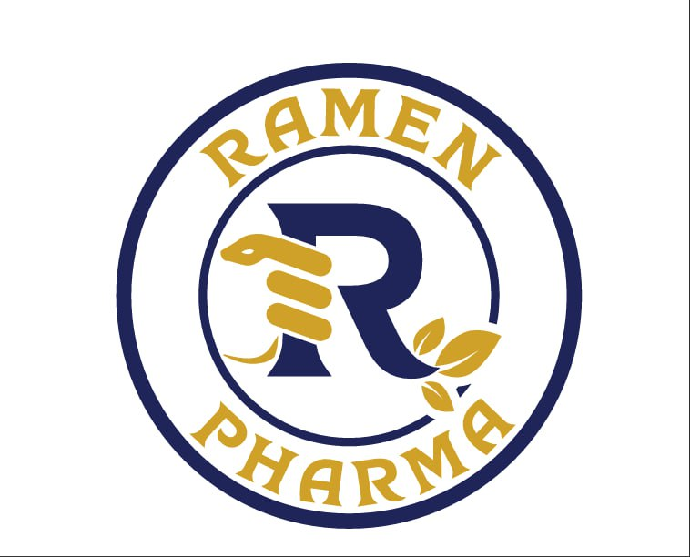

# 💊 Ramen Pharma

A full-stack pharmaceutical web platform built to help companies **showcase their products**, **highlight their sponsors**, **gather real customer reviews**, and **display pharmacy locations** via maps — all through a secure and scalable admin dashboard.

  

---

## 🚀 Live Demo  
https://ramen-pharma.com/ 

---

## 📸 Presentation Lookbook  
Check out the full visual walkthrough of this project:  
👉 [View the Project Presentation](https://www.canva.com/design/DAGrZLlaF0c/HlhbTKttzQBBzwbnohC-DA/edit?utm_content=DAGrZLlaF0c&utm_campaign=designshare&utm_medium=link2&utm_source=sharebutton)

---

## 🧠 Built With

| Technology | Role |
|------------|------|
| Laravel 10 | Backend & RESTful API |
| MySQL | Database |
| JWT Auth | User/Admin authentication |
| Google Maps / Leaflet | Display pharmacy locations |
| SMTP (Gmail) | Admin replies to contact messages |
| Next.js | Frontend (by [@Abdelrahman Al-Olaa](https://github.com/abdalrhman-abdalalim)) |

---

## 🧩 Key Features

- ✅ Product and sponsor management
- ✅ Map integration with pharmacy locations (lat & long)
- ✅ Ratings & reviews for products
- ✅ Contact form with admin replies via dashboard & Gmail
- ✅ Fully protected admin panel
- ✅ Clean API structure

---

## 🧑‍💻 Contributors

- **Abdelrahman Abdelsamie** — Laravel Developer  
- **Abdelrahman Al-Olaa** — Frontend Developer (Next.js)  
🧠 _Powered by our new company: **Kernel**_

---

## 📬 Contact Us

Looking to build your next digital product?  
We’re open to freelance opportunities and collaborations.

📧 Email: abdelrhmanabdelsamie@gmail.com  
🌐 LinkedIn: [linkedin.com/in/abdelrahmanabdelsamie](https://linkedin.com/in/abdelrahmanabdelsamie)  
📦 GitHub: [github.com/abdelrahmanabdelsamie7](https://github.com/abdelrahmanabdelsamie7)

---

## 📝 License

This project is licensed under the MIT License — see the [LICENSE](LICENSE) file for details.
